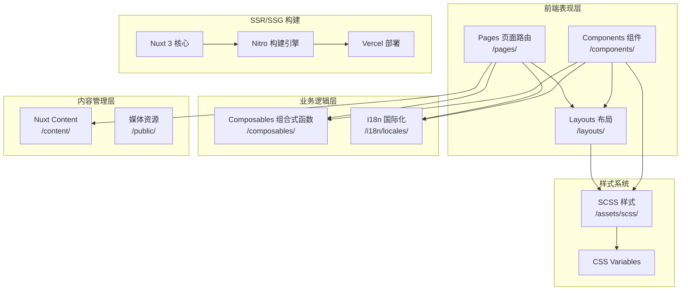
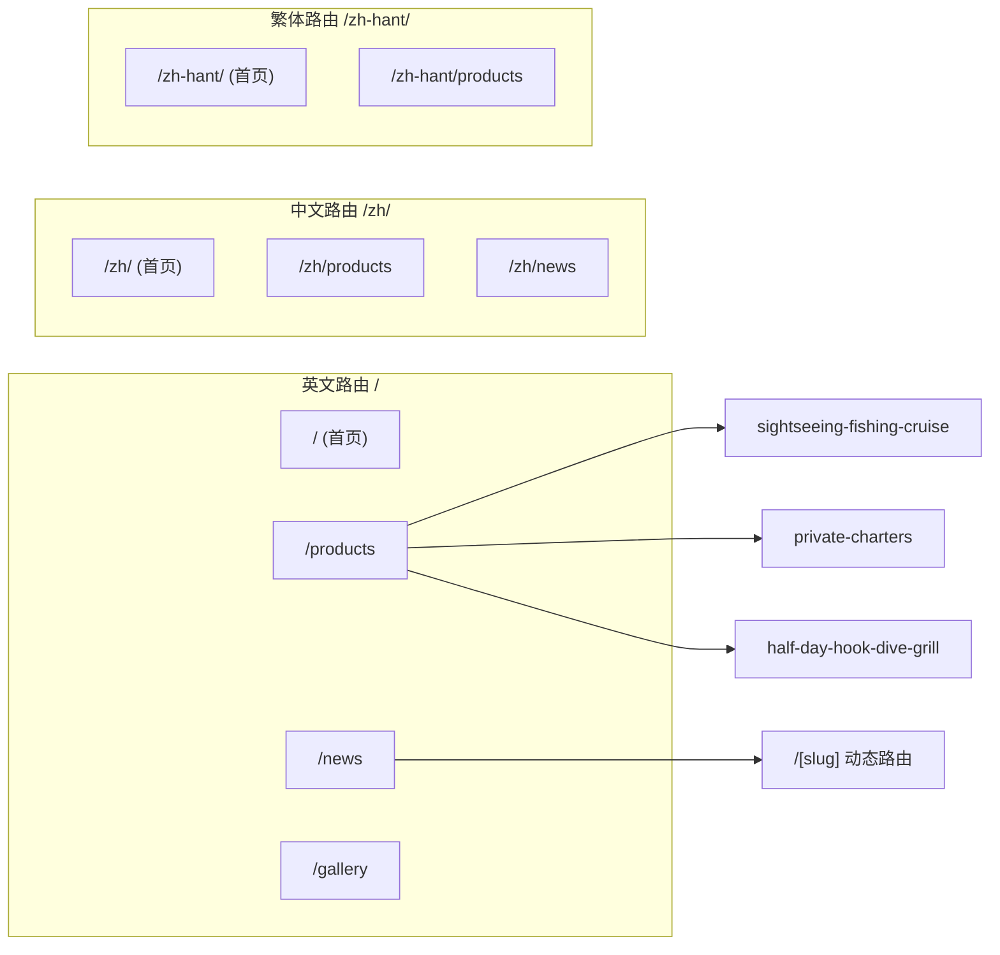

本文档介绍 **Diver's Fishing Charters Hobart** 旅游官网项目，这是一个从旧版 Vue.js SPA 迁移至 Nuxt 3 静态站点生成（SSG）架构的现代化旅游预订网站。项目部署于 Vercel 平台，支持简体中文、繁体中文和英文三种语言。

## 项目背景与目标

本项目原站使用 Vue.js 伪静态方案构建，存在多个 SEO 技术缺陷。Phase 1 的核心目标是将网站迁移至 Nuxt 3 SSG 架构，修复所有 SEO 问题，并为后续 Phase 2 预订系统集成预留接口。

项目于 2026 年 4 月 12 日完成迁移，涵盖首页、产品展示、相册、新闻、联系页面等全部核心内容的完整迁移。

Sources: [PHASE1_SUMMARY.md](PHASE1_SUMMARY.md#L1-L30)

## 技术栈概览

项目采用现代前端技术栈构建，以下为核心组件的技术选型：

| 组件类别 | 技术选型 | 说明 |
|---------|---------|------|
| 框架 | Nuxt 3 (Vue 3 + TypeScript) | 基于 Vue 3 的全栈框架 |
| 渲染模式 | SSG (Static Site Generation) | 使用 `nuxt generate` 构建纯静态 HTML |
| 部署平台 | Vercel | 使用 vercel-static preset |
| 多语言 | @nuxtjs/i18n v9 | 支持 en/zh/zh-hant 三种语言 |
| 内容管理 | Nuxt Content | Markdown 格式内容管理 |
| 样式方案 | SCSS + CSS Variables | 响应式设计系统 |
| SEO 工具 | @nuxtjs/sitemap | 自动生成站点地图 |

Sources: [nuxt.config.ts](nuxt.config.ts#L1-L20), [package.json](package.json#L1-L30)

## 核心功能特性

### 多语言国际化

项目采用 `prefix_except_default` 路由策略，英文版本无语言前缀（`/`），简体中文使用 `/zh/`，繁体中文使用 `/zh-hant/` 前缀。浏览器语言自动检测功能通过 Cookie 记录用户语言偏好，确保首次访问后自动跳转至对应语言版本。

Sources: [nuxt.config.ts](nuxt.config.ts#L60-L85)

### SEO 优化体系

项目建立了完整的 SEO 优化体系，包括语义化 HTML 标签结构、JSON-LD 结构化数据、Open Graph 和 Twitter Card 元标签配置。结构化数据涵盖 TravelAgency（旅行社）、TouristTrip（旅游产品）、BreadcrumbList（面包屑导航）和 WebSite（网站信息）四种 Schema.org 类型。

Sources: [composables/useJsonLd.ts](composables/useJsonLd.ts#L1-L107)

### 响应式设计系统

项目使用 SCSS 变量定义颜色系统、字体规格、断点阈值和阴影效果等设计令牌。响应式布局通过 `@include lg`、`@include md` 等 mixin 实现，支持从移动端到超大屏幕的全设备适配。

Sources: [assets/scss/_variables.scss](assets/scss/_variables.scss#L1-L94), [assets/scss/_mixins.scss](assets/scss/_mixins.scss#L1-L57)

## 架构设计

### 系统架构图

以下 Mermaid 图表展示了项目的整体架构设计：



### 页面路由结构



Sources: [nuxt.config.ts](nuxt.config.ts#L22-L50)

## 项目目录结构

```
tasyachttrip/
├── nuxt.config.ts              # 核心配置文件（模块、预渲染路由、i18n）
├── vercel.json                 # Vercel 部署配置
├── app.vue                     # 根组件
│
├── assets/
│   └── scss/
│       ├── main.scss           # 全局样式入口 + CSS Reset
│       ├── _variables.scss      # 设计令牌（颜色/字体/断点）
│       └── _mixins.scss        # 响应式布局 mixin
│
├── components/
│   ├── layout/
│   │   ├── AppHeader.vue       # 顶部导航 + 移动端菜单
│   │   ├── AppFooter.vue        # 页脚（联系信息/社交链接）
│   │   ├── LanguageSwitcher.vue # 语言切换下拉组件
│   │   └── AppBreadcrumb.vue    # 面包屑导航（含 JSON-LD）
│   ├── ui/
│   │   ├── UiSection.vue       # 页面区块容器
│   │   ├── UiCard.vue           # 产品卡片组件
│   │   └── UiButton.vue         # 按钮组件
│   └── seo/
│       └── JsonLdMarkup.vue     # JSON-LD 结构化数据组件
│
├── composables/
│   ├── useJsonLd.ts            # 结构化数据生成（TravelAgency/TouristTrip）
│   ├── useImageAlt.ts          # 多语言图片 alt 文本处理
│   └── useGallery.ts           # 相册筛选 + 分页逻辑
│
├── i18n/locales/
│   ├── en.json                 # 英文 UI 翻译
│   ├── zh.json                 # 简体中文翻译
│   └── zh-hant.json            # 繁体中文翻译
│
├── pages/
│   ├── index.vue               # 首页
│   ├── about.vue               # 关于我们
│   ├── contact.vue             # 联系我们
│   ├── faq.vue                 # 常见问题
│   ├── products/
│   │   ├── index.vue           # 产品列表
│   │   ├── sightseeing-fishing-cruise.vue
│   │   ├── private-charters.vue
│   │   └── half-day-hook-dive-grill.vue
│   ├── news/
│   │   ├── index.vue           # 新闻列表
│   │   └── [slug].vue          # 新闻详情（动态路由）
│   ├── gallery/
│   │   └── index.vue           # 相册（5分类 + 分页）
│   ├── zh/                     # 简体中文版本页面
│   └── zh-hant/                # 繁体中文版本页面
│
├── content/
│   ├── en/products/            # 英文产品内容
│   ├── zh/products/            # 中文产品内容
│   └── zh-hant/products/       # 繁体产品内容
│
├── layouts/
│   └── default.vue             # 默认布局（Header + Main + Footer）
│
├── public/
│   ├── robots.txt              # 搜索引擎指令
│   └── favicon.svg             # 网站图标
│
└── server/api/
    └── sitemap.xml.ts          # 动态站点地图生成
```

Sources: [README.md](README.md#L15-L70)

## 核心模块详解

### 布局系统

默认布局 `layouts/default.vue` 采用经典的三段式结构：固定顶部导航栏（AppHeader）、主内容区域（slot）、页脚信息（AppFooter）。这种结构确保了全站导航的一致性。

Sources: [layouts/default.vue](layouts/default.vue#L1-L13)

### JSON-LD 结构化数据

`useJsonLd` composable 封装了所有 Schema.org 结构化数据的生成逻辑。它支持四种类型的数据注入：TravelAgency（用于首页和产品页的企业信息）、TouristTrip（产品详情页的价格和描述）、BreadcrumbList（带正确静态 URL 的面包屑）和 WebSite（首页的搜索引擎优化）。

Sources: [composables/useJsonLd.ts](composables/useJsonLd.ts#L1-L107), [pages/index.vue](pages/index.vue#L60-L75)

### 相册管理

`useGallery` composable 管理 21 张图片数据，分为 5 个分类（vessel/fishing/diving/nature/happy-moments），支持 12 张/页的分页显示。每个图片包含中英文 alt 文本，相册页面通过语言切换自动显示对应文本。

Sources: [composables/useGallery.ts](composables/useGallery.ts#L1-L97)

### 多语言路由

项目采用文件约定式路由与 i18n 模块结合的方式。英文作为默认语言（无前缀），中文版本页面放置在 `/pages/zh/` 目录，繁体中文版本放置在 `/pages/zh-hant/` 目录。`localePath()` 函数自动处理各语言版本的路由跳转。

Sources: [components/layout/AppHeader.vue](components/layout/AppHeader.vue#L1-L50)

## 部署与构建

### Vercel 部署配置

项目使用 Vercel 平台的 vercel-static preset 进行静态站点部署。构建命令为 `npm run generate`，静态产物输出至 `.output/public` 目录。配置文件同时设置了安全响应头（X-Content-Type-Options、X-Frame-Options）和 sitemap.xml 的 Content-Type。

Sources: [vercel.json](vercel.json#L1-L22)

### 预渲染路由

项目在 `nuxt.config.ts` 中显式声明了所有需要预渲染的路由，包括英文、中文、繁体中文三个语言版本的所有页面，以及新闻详情页的 slug 路由。这确保了构建时生成完整的静态 HTML 文件。

Sources: [nuxt.config.ts](nuxt.config.ts#L22-L50)

## SEO 修复成果

Phase 1 完成了以下关键 SEO 问题的修复：

| 问题类型 | 修复前 | 修复后 |
|---------|-------|-------|
| 重复 H1 | CSS clip 隐藏第二个 | 每页仅一个可见 H1 |
| 语义化标签 | 使用 `<div>` | 正确使用 H1/H2/H3 |
| 图片 Alt | 全部缺失 | useImageAlt 自动处理 |
| 面包屑 URL | hash 路由 `#/xxx` | 静态 URL `/xxx` |
| og:image | 相对路径 | 绝对 URL |
| Canonical | JS 动态注入 | SSG 天然支持 |
| 新闻 URL | `/news/6` 数字 ID | `/news/slug` 关键词 |
| Sitemap | 缺失 | server/api/sitemap.xml.ts |
| robots.txt | 缺失 | public/robots.txt |

Sources: [PHASE1_SUMMARY.md](PHASE1_SUMMARY.md#L60-L90)

## 下一步学习路径

完成本概述文档后，建议按以下顺序深入学习项目各模块：

**快速入门** → [快速开始](2-kuai-su-kai-shi)：了解项目本地启动和构建命令

**开发环境** → [环境要求与安装](3-huan-jing-yao-qiu-yu-an-zhuang)：配置 Node.js 20+ 环境 → [本地开发与构建](4-ben-di-kai-fa-yu-gou-jian)：掌握 dev/build/preview 工作流

**核心概念** → [项目架构总览](5-xiang-mu-jia-gou-zong-lan)：深入理解 Nuxt 3 模块系统 → [多语言路由策略](6-duo-yu-yan-lu-you-ce-lue)：掌握 i18n 配置细节

**样式系统** → [SCSS 变量配置](7-scss-bian-liang-pei-zhi)：学习设计令牌体系 → [响应式 Mixin 封装](8-xiang-ying-shi-mixin-feng-zhuang)：掌握响应式布局方案