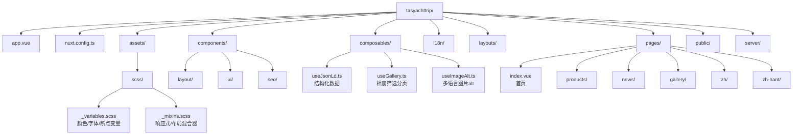

本文档为初次接触本项目的开发者提供完整的上手指南，涵盖环境配置、安装步骤、核心命令以及项目结构概览，帮助你在最短时间内启动本地开发环境并理解项目架构。

## 环境要求

在开始之前，请确保你的开发环境满足以下要求。这些是运行 Nuxt 3 项目的必要条件。

| 组件 | 最低版本 | 推荐版本 | 说明 |
|------|----------|----------|------|
| Node.js | 18.0+ | 20.x LTS | JavaScript 运行时环境 |
| npm | 9.0+ | 10.x | Node.js 自带的包管理器 |
| Git | 任意版本 | 最新版 | 用于版本控制（可选） |

**验证环境**：打开终端执行以下命令确认版本：

```bash
node --version   # 应显示 v20.x.x 或更高
npm --version    # 应显示 10.x.x 或更高
```

Sources: [package.json](package.json#L1-L15)
Sources: [README.md](README.md#L21-L22)

## 安装步骤

### 第一步：克隆或下载项目

如果你从 GitHub 获取项目，使用以下命令：

```bash
git clone https://github.com/your-repo/tasyachttrip.git
cd tasyachttrip
```

或者直接将项目文件夹放入你的工作目录。

### 第二步：安装依赖

项目依赖通过 npm 安装，位于 `package.json` 的 `dependencies` 和 `devDependencies` 字段中定义：

```bash
npm install
```

安装过程会自动执行 `postinstall` 脚本，运行 `nuxt prepare` 命令来生成类型定义文件。安装完成后，你会在项目根目录看到新增的 `.nuxt` 文件夹。

Sources: [package.json](package.json#L1-L30)

### 第三步：启动开发服务器

安装完成后，运行以下命令启动本地开发服务器：

```bash
npm run dev
```

Nuxt 会自动启动开发服务器，默认访问地址为 `http://localhost:3000`。首次启动可能需要等待几秒钟让 Nuxt 完成初始化。

Sources: [README.md](README.md#L15-L16)

## 核心命令

项目提供了一套完整的 npm 脚本，定义在 `package.json` 的 `scripts` 字段中。

| 命令 | 功能 | 使用场景 |
|------|------|----------|
| `npm run dev` | 启动开发服务器（热重载） | 日常开发，代码修改后自动刷新 |
| `npm run build` | 构建生产版本（SSR） | 部署到支持 SSR 的服务器 |
| `npm run generate` | 生成静态站点（SSG） | 部署到 Vercel 等静态托管平台 |
| `npm run preview` | 预览本地构建产物 | 检查 `nuxt generate` 输出的静态文件 |
| `npm run lint` | 运行 ESLint 代码检查 | 保持代码风格一致 |
| `npm run typecheck` | 运行 TypeScript 类型检查 | 提前发现类型错误 |

**推荐开发流程**：开发时使用 `dev`，准备部署时使用 `generate`，然后用 `preview` 验证静态输出。

Sources: [package.json](package.json#L5-L12)

## 项目结构概览

理解项目结构是掌握 Nuxt 3 开发的关键。以下是项目的核心目录和文件说明：



### 核心文件说明

**入口文件**：`app.vue` 是整个应用的根组件，使用 `<NuxtLayout>` 和 `<NuxtPage>` 组件来渲染布局和页面内容。

**配置文件**：`nuxt.config.ts` 定义了 Nuxt 的所有核心配置，包括 SSR 模式、i18n 多语言、样式处理、SEO 设置等。

Sources: [app.vue](app.vue#L1-L15)
Sources: [nuxt.config.ts](nuxt.config.ts#L1-L110)

### 页面目录结构

```
pages/
├── index.vue              # 首页（默认英文）
├── about.vue              # 关于我们
├── contact.vue            # 联系我们
├── faq.vue                # 常见问题
├── products/
│   ├── index.vue          # 产品列表
│   ├── sightseeing-fishing-cruise.vue
│   ├── private-charters.vue
│   └── half-day-hook-dive-grill.vue
├── news/
│   ├── index.vue          # 新闻列表
│   └── [slug].vue         # 新闻详情（动态路由）
├── gallery/
│   └── index.vue          # 相册页面
├── zh/                    # 简体中文版本
└── zh-hant/               # 繁体中文版本
```

Sources: [PHASE1_SUMMARY.md](PHASE1_SUMMARY.md#L50-L70)

### 组件目录结构

```
components/
├── layout/
│   ├── AppHeader.vue      # 顶部导航（含移动端菜单）
│   ├── AppFooter.vue      # 页脚
│   ├── LanguageSwitcher.vue  # 语言切换下拉框
│   └── AppBreadcrumb.vue  # 面包屑导航
├── ui/
│   ├── UiSection.vue      # 页面区块容器
│   ├── UiCard.vue         # 产品卡片组件
│   └── UiButton.vue       # 按钮组件
└── seo/
    └── JsonLdMarkup.vue   # JSON-LD 结构化数据组件
```

Sources: [PHASE1_SUMMARY.md](PHASE1_SUMMARY.md#L35-L45)

## 关键配置解析

### 多语言配置

项目使用 `@nuxtjs/i18n` 模块实现三种语言的切换：英文（默认）、简体中文、繁体中文。配置位于 `nuxt.config.ts` 的 `i18n` 字段：

```typescript
i18n: {
  locales: [
    { code: 'en', iso: 'en-AU', name: 'English', file: 'en.json' },
    { code: 'zh', iso: 'zh-CN', name: '简体中文', file: 'zh.json' },
    { code: 'zh-hant', iso: 'zh-TW', name: '繁體中文', file: 'zh-hant.json' },
  ],
  defaultLocale: 'en',
  strategy: 'prefix_except_default',  // 英文无前缀，中文 /zh/，繁体 /zh-hant/
}
```

Sources: [nuxt.config.ts](nuxt.config.ts#L50-L62)

### 预渲染路由配置

由于采用静态站点生成（SSG）模式，`nuxt.config.ts` 中的 `nitro.prerender.routes` 定义了所有需要预渲染的页面路径：

```typescript
nitro: {
  preset: 'vercel-static',
  prerender: {
    crawlLinks: true,
    routes: ['/', '/zh/', '/products', '/about', ...]
  }
}
```

Sources: [nuxt.config.ts](nuxt.config.ts#L10-L40)

## 常用开发模式

### 使用布局组件

布局文件位于 `layouts/default.vue`，定义了页面通用结构（头部导航、内容区、页脚）。所有页面自动应用此布局：

```vue
<!-- layouts/default.vue -->
<template>
  <div class="app-layout">
    <AppHeader />
    <main class="main-content">
      <slot />
    </main>
    <AppFooter />
  </div>
</template>
```

Sources: [layouts/default.vue](layouts/default.vue#L1-L13)

### 使用 Composables

Composables 是 Nuxt 3 的组合式函数，用于封装可复用的逻辑：

| Composable | 功能 | 主要方法 |
|------------|------|----------|
| `useJsonLd` | 生成结构化数据 | `useTravelAgency()`, `useBreadcrumbList()` |
| `useImageAlt` | 多语言图片 alt | `getImageAlt(image)` |
| `useGallery` | 相册筛选分页 | `setCategory()`, `setPage()` |

Sources: [composables/useJsonLd.ts](composables/useJsonLd.ts#L1-L107)
Sources: [composables/useImageAlt.ts](composables/useImageAlt.ts#L1-L35)
Sources: [composables/useGallery.ts](composables/useGallery.ts#L1-L97)

### 页面开发示例

以首页为例，展示了如何使用 i18n、composables 和组件：

```vue
<script setup lang="ts">
const localePath = useLocalePath()
const { t } = useI18n()
const { useTravelAgency, useWebSite, useBreadcrumbList } = useJsonLd()

// 注入 JSON-LD 结构化数据
useTravelAgency()
useWebSite()
useBreadcrumbList([{ name: 'Home', path: '/' }])

// 设置页面 SEO
useHead({
  title: t('seo.defaultTitle'),
  meta: [
    { name: 'description', content: t('seo.homeDescription') },
  ],
})
</script>
```

Sources: [pages/index.vue](pages/index.vue#L70-L90)

## 下一步学习

完成快速开始后，建议按以下顺序深入学习：

| 顺序 | 文档 | 内容 |
|------|------|------|
| 1 | [项目概述](1-xiang-mu-gai-shu) | 项目背景和技术选型理由 |
| 2 | [环境要求与安装](3-huan-jing-yao-qiu-yu-an-zhuang) | 详细的环境配置指南 |
| 3 | [本地开发与构建](4-ben-di-kai-fa-yu-gou-jian) | 开发命令详解和调试技巧 |
| 4 | [项目架构总览](5-xiang-mu-jia-gou-zong-lan) | 深入理解架构设计 |
| 5 | [SCSS 变量配置](7-scss-bian-liang-pei-zhi) | 样式系统定制 |