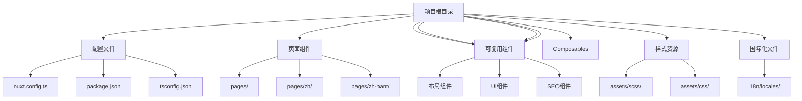
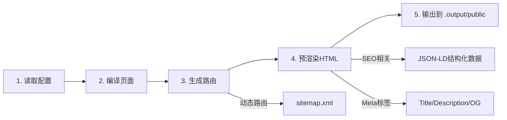
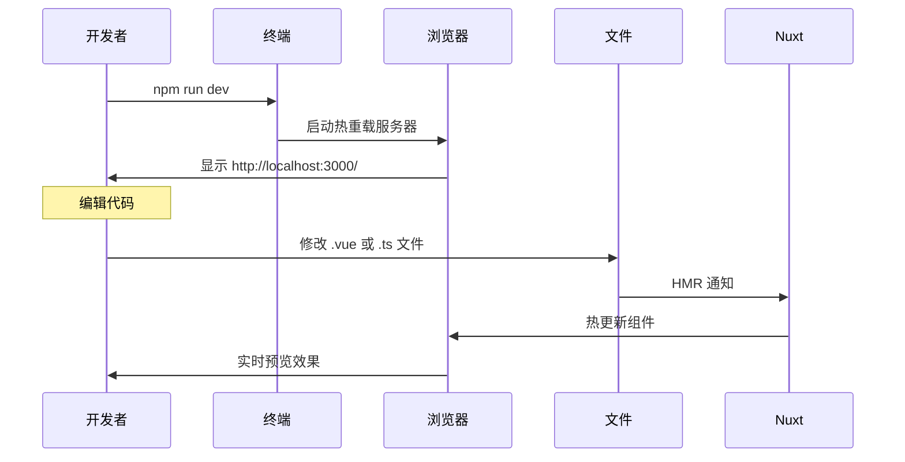

本文档面向初级开发者，详细介绍 tasyachttrip 项目的本地开发环境配置、常用开发命令以及构建流程。本项目基于 Nuxt 3 框架构建，采用 SSG（Static Site Generation）静态站点生成模式，支持英文、简体中文和繁体中文三种语言。

## 环境准备

### 系统要求

在开始开发之前，请确保你的开发环境满足以下最低要求：

| 组件 | 最低版本 | 推荐版本 | 说明 |
|------|----------|----------|------|
| Node.js | 20.x | 22.x LTS | Nuxt 3 要求 Node.js 20 及以上版本 |
| npm | 9.x | 10.x | 包管理器，随 Node.js 一起安装 |
| Git | 任意版本 | 最新版 | 用于版本控制（可选但推荐） |

你可以通过以下命令检查当前安装的版本：

```bash
node --version
npm --version
```

Sources: [package.json](package.json#L1-L14)

### 开发工具建议

- **代码编辑器**：VS Code（推荐），配合 Volar 插件可获得最佳的 Vue/Nuxt 开发体验
- **终端**：Windows Terminal 或 Git Bash
- **浏览器**：Chrome/Edge（内置 Vue DevTools 支持）

## 依赖安装

### 首次初始化

克隆项目后，在项目根目录执行以下命令安装所有依赖：

```bash
cd tasyachttrip
npm install
```

`npm install` 会自动读取 `package.json` 中的依赖列表，包括：

| 依赖类型 | 包含内容 |
|----------|----------|
| **运行时依赖** | nuxt, vue, vue-router, @nuxtjs/i18n, @nuxt/content, @nuxtjs/sitemap |
| **开发依赖** | @nuxt/devtools, sass, typescript, @types/node |

Sources: [package.json](package.json#L1-L29)

安装完成后，会生成 `node_modules` 文件夹和 `package-lock.json` 锁定文件。请勿手动修改 `package-lock.json`，所有依赖变更都应通过 `npm install/npm uninstall` 命令进行。

### postinstall 脚本

每次安装依赖后，Nuxt 会自动执行 `nuxt prepare` 命令，生成 `.nuxt` 目录和 TypeScript 类型声明文件。这是 Nuxt 框架的常规操作，无需手动干预。

Sources: [package.json](package.json#L11)

## 开发服务器

### 启动开发模式

执行以下命令启动热重载开发服务器：

```bash
npm run dev
```

启动后，你会看到类似以下的输出：

```
Nuxi v3.15.0
Nuxt v3.15.0

  ➜ Local:    http://localhost:3000/
  ➜ Network:  http://192.168.x.x:3000/
```

### 开发模式特性

在开发模式下，Nuxt 提供以下功能：

- **热模块替换（HMR）**：修改代码后，浏览器会自动刷新，无需手动刷新页面
- **类型检查**：自动进行 TypeScript 类型检查，错误信息会显示在终端和控制台
- **Vue DevTools**：在浏览器开发者工具中查看组件树、状态和路由信息
- **Nuxt DevTools**：提供可视化的调试和性能分析工具

Sources: [nuxt.config.ts](nuxt.config.ts#L5)

### 访问多语言版本

开发服务器启动后，你可以通过以下 URL 访问不同语言版本：

| 语言 | URL | 说明 |
|------|-----|------|
| 英文（默认） | http://localhost:3000/ | 无语言前缀 |
| 简体中文 | http://localhost:3000/zh/ | 带 `/zh/` 前缀 |
| 繁体中文 | http://localhost:3000/zh-hant/ | 带 `/zh-hant/` 前缀 |

Sources: [nuxt.config.ts](nuxt.config.ts#L79-L94)

## 项目结构概览

理解项目结构对于高效开发至关重要：



Sources: [README.md](README.md#L32-L75)

## npm 脚本详解

`package.json` 中定义了以下可执行脚本：

| 命令 | 实际执行 | 用途 |
|------|----------|------|
| `npm run dev` | `nuxt dev` | 启动开发服务器 |
| `npm run build` | `nuxt build` | 生产构建（SSR 模式） |
| `npm run generate` | `nuxt generate` | 静态站点生成（SSG） |
| `npm run preview` | `nuxt preview` | 预览静态构建产物 |
| `npm run lint` | `eslint .` | 代码风格检查 |
| `npm run typecheck` | `nuxt typecheck` | TypeScript 类型检查 |

Sources: [package.json](package.json#L6-L13)

## 构建流程详解

### 本地静态站点生成

当需要验证构建结果或准备部署时，执行以下命令生成静态站点：

```bash
npm run generate
```

### 构建流程图



### 构建产物

构建完成后，所有静态文件输出到 `.output/public` 目录：

```
.output/public/
├── index.html              # 首页
├── zh/
│   └── index.html          # 中文首页
├── zh-hant/
│   └── index.html          # 繁体中文首页
├── products/
│   └── sightseeing-fishing-cruise.html
├── sitemap.xml
├── robots.txt
└── ...其他静态资源
```

Sources: [nuxt.config.ts](nuxt.config.ts#L13-L53)

### 预渲染路由配置

`nuxt.config.ts` 中定义了完整的预渲染路由列表，确保所有页面在构建时生成静态 HTML：

Sources: [nuxt.config.ts](nuxt.config.ts#L17-L52)

## 预览构建结果

生成静态文件后，使用预览命令在本地测试：

```bash
npm run preview
```

预览服务器会在本地启动，模拟 Vercel 生产环境的行为。这是在部署前验证站点外观和功能的必要步骤。

## 开发工作流

### 日常开发步骤



### 添加新页面的流程

1. 在 `pages/` 目录下创建新的 `.vue` 文件
2. 重启开发服务器（Nuxt 会自动注册新路由）
3. 访问新页面验证
4. 如需预渲染，将路由添加到 `nuxt.config.ts` 的 `prerender.routes` 数组中

### 添加多语言支持的流程

1. 在 `i18n/locales/` 目录下的翻译文件中添加新的 key
2. 在页面组件中使用 `useI18n()` 获取翻译文本
3. 在 `pages/zh/` 和 `pages/zh-hant/` 创建对应语言的页面

## 样式开发

### SCSS 变量

项目使用 SCSS 预处理，变量定义在 `assets/scss/_variables.scss` 中：

Sources: [assets/scss/_mixins.scss](assets/scss/_mixins.scss#L1-L57)

### Mixin 封装

项目提供了常用的 SCSS mixin，简化响应式布局和组件样式：

| Mixin | 用途 |
|-------|------|
| `@include flex-center` | 居中对齐布局 |
| `@include flex-between` | 两端对齐布局 |
| `@include button-base` | 按钮基础样式 |
| `@include card` | 卡片组件样式 |
| `@include img-cover` | 图片覆盖容器 |

Sources: [assets/scss/_mixins.scss](assets/scss/_mixins.scss#L1-L57)

### CSS 引入

全局 CSS 在 `nuxt.config.ts` 中配置：

Sources: [nuxt.config.ts](nuxt.config.ts#L96)

## 常见问题排查

### 问题一：端口被占用

```
Error: listen EADDRINUSE :::3000
```

**解决方案**：终止占用 3000 端口的进程，或在 `package.json` 中修改 dev 脚本为 `nuxt dev --port 3001`

### 问题二：依赖安装失败

**解决方案**：
```bash
# 清理缓存
npm cache clean --force
# 删除 node_modules 和 package-lock.json
rm -rf node_modules package-lock.json
# 重新安装
npm install
```

### 问题三：构建时 TypeScript 错误

**解决方案**：运行类型检查定位问题
```bash
npm run typecheck
```

### 问题四：样式不生效

**检查项**：
1. 确认 SCSS 文件已正确导入
2. 检查是否有语法错误
3. 清除浏览器缓存或使用硬刷新（Ctrl+Shift+R）

### 问题五：多语言路由不工作

**检查项**：
1. 确认 `pages/zh/` 和 `pages/zh-hant/` 目录结构与 `pages/` 一致
2. 检查 `nuxt.config.ts` 中的 i18n 配置是否正确
3. 确认翻译文件存在于 `i18n/locales/` 目录

## 下一步

完成本地开发环境配置后，建议继续阅读以下文档：

- [项目架构总览](5-xiang-mu-jia-gou-zong-lan) — 深入了解项目的整体架构设计
- [多语言路由策略](6-duo-yu-yan-lu-you-ce-lue) — 了解 i18n 的路由配置细节
- [SCSS 变量配置](7-scss-bian-liang-pei-zhi) — 掌握样式系统的变量定义