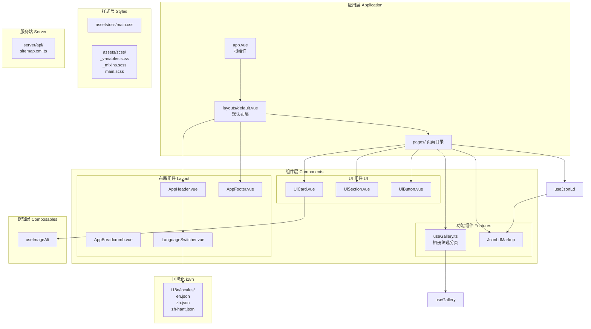
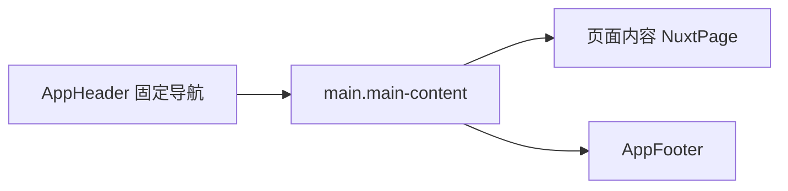
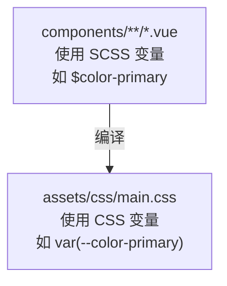

本文档详细介绍 Diver's Fishing Charters Hobart 网站的技术架构，涵盖核心技术栈、目录组织、模块职责划分以及关键设计模式。本项目是一个基于 Nuxt 3 的多语言旅游网站，面向塔斯马尼亚霍巴特的钓鱼潜水包船业务。

## 技术栈概览

本项目采用 **Nuxt 3** 作为核心框架，结合多个官方模块实现国际化、SEO 优化和静态站点生成。以下是主要技术组件及其作用：

| 模块 | 版本 | 用途 |
|------|------|------|
| Nuxt | ^3.15.0 | Vue 3 SSR/SSG 框架核心 |
| @nuxtjs/i18n | ^9.0.0 | 三语言国际化路由与翻译 |
| @nuxt/content | ^2.13.4 | Markdown 内容管理 |
| @nuxtjs/sitemap | ^6.0.0 | 站点地图自动生成 |
| Sass | ^1.97.0 | SCSS 预处理器 |
| Vue | ^3.5.13 | 渐进式 UI 框架 |

Sources: [package.json](package.json#L1-L29)

项目配置中启用了 SSR 模式（`ssr: true`）并针对 Vercel 静态部署进行了优化，预渲染路由覆盖三种语言版本共 51 条路由。

Sources: [nuxt.config.ts](nuxt.config.ts#L1-L109)

## 核心架构图



## 目录结构与职责

### 页面目录结构（Pages）

项目采用**混合路由策略**：静态页面使用独立文件，动态页面使用动态路由参数。

```
pages/
├── index.vue                    # 首页 (/)
├── about.vue                    # 关于我们
├── contact.vue                  # 联系方式
├── faq.vue                      # 常见问题
├── gallery/
│   └── index.vue                # 相册页面
├── news/
│   ├── index.vue                # 新闻列表
│   └── [slug].vue               # 动态新闻详情页
├── products/
│   ├── index.vue                # 产品列表
│   ├── sightseeing-fishing-cruise.vue
│   ├── private-charters.vue
│   └── half-day-hook-dive-grill.vue
├── zh/                          # 简体中文版本
│   ├── index.vue
│   ├── about.vue
│   ├── contact.vue
│   ├── faq.vue
│   ├── gallery/
│   ├── news/
│   └── products/
└── zh-hant/                     # 繁体中文版本
    ├── index.vue
    └── products/
```

这种结构与 i18n 模块的 `prefix_except_default` 策略配合，默认语言（English）使用无前缀路径，而中文版本使用 `/zh/` 和 `/zh-hant/` 前缀。

Sources: [nuxt.config.ts](nuxt.config.ts#L79-L94)

### 组件目录组织

组件按照功能域进行分类，这种组织方式便于代码维护和团队协作：

| 目录 | 组件 | 职责 |
|------|------|------|
| `components/layout/` | AppHeader, AppFooter, AppBreadcrumb, LanguageSwitcher | 页面布局、导航、语言切换 |
| `components/ui/` | UiCard, UiSection, UiButton | 可复用的 UI 原子组件 |
| `components/seo/` | JsonLdMarkup | SEO 结构化数据注入 |
| `components/form/` | (待扩展) | 表单组件 |
| `components/gallery/` | (待扩展) | 相册专用组件 |

Sources: [layouts/default.vue](layouts/default.vue#L1-L13)

### 布局系统架构

项目使用 Nuxt 3 的布局系统，`app.vue` 作为根组件挂载默认布局：

```vue
<template>
  <NuxtLayout>
    <NuxtPage />
  </NuxtLayout>
</template>
```

`layouts/default.vue` 实现了经典的三段式布局结构：固定顶部导航、主内容区、页脚：



Sources: [app.vue](app.vue#L1-L15)
Sources: [layouts/default.vue](layouts/default.vue#L1-L13)

## 核心模块详解

### Composables 逻辑封装

项目定义了三个核心 Composable 模块，用于封装可复用的响应式逻辑：

#### 1. useGallery 相册管理

`useGallery.ts` 实现了图片库的客户端筛选和分页逻辑，定义了两个核心接口和一个常量配置：

```typescript
interface GalleryImage {
  id: string
  category: string      // vessel | fishing | diving | nature | happy-moments
  url: string
  thumb: string
  alt: string           // 默认语言
  alt_zh: string        // 简体中文
  alt_zh_hant: string   // 繁体中文
  pinned?: boolean
}
```

相册数据硬编码在模块内（18 张示例图片），支持按类别筛选并以 12 张为基准进行分页。该模块导出的响应式状态包括：`activeCategory`、`currentPage`、`filteredImages`、`paginatedImages`。

Sources: [composables/useGallery.ts](composables/useGallery.ts#L1-L96)

#### 2. useJsonLd 结构化数据

`useJsonLd.ts` 封装了 Schema.org 结构化数据的构建逻辑，支持四种类型：

| Schema 类型 | 用途 | 关键字段 |
|-------------|------|----------|
| TravelAgency | 旅行社信息 | name, url, telephone, address, geo, openingHours |
| TouristTrip | 旅游产品 | name, description, url, image, offers |
| BreadcrumbList | 面包屑导航 | itemListElement[position, name, item] |
| WebSite | 网站整体 | name, url, potentialAction |

该模块通过 `addSchema()` 方法向 `schemas` 响应式数组追加数据，最终由 `JsonLdMarkup.vue` 组件序列化为 `<script type="application/ld+json">` 标签注入页面头部。

Sources: [composables/useJsonLd.ts](composables/useJsonLd.ts#L1-L106)

#### 3. useImageAlt 多语言 Alt 文本

`useImageAlt.ts` 实现了图片 Alt 文本的动态语言切换：

```typescript
function getImageAlt(image: ImageWithAlt): string {
  switch (locale.value) {
    case 'zh':    return image.alt_zh || image.alt || ''
    case 'zh-hant': return image.alt_zh_hant || image.alt || ''
    default:      return image.alt || ''
  }
}
```

这种设计确保每张图片都拥有三种语言的 SEO 友好描述文本。

Sources: [composables/useImageAlt.ts](composables/useImageAlt.ts#L1-L34)

### 组件通信模式

组件间主要采用以下通信方式：

```mermaid
flowchart LR
    subgraph "Props Down"
        parent["父组件<br>pages/index.vue"] --> |":title<br>:hoverable| child["UiCard.vue"]
    end
    
    subgraph "Events Up"
        child --> |"@click" emit| parent
    end
    
    subgraph "Provide/Inject"
        i18n["useI18n()"] -.-> |"全局可用"| composables
    end
    
    subgraph "Composable"
        composables["useJsonLd()<br>useGallery()"]
    end
```

**Props Down**：父组件通过 props 向子组件传递配置，如 `UiCard` 的 `title`、`hoverable` 属性。

**Composables**：使用 Vue 3 Composition API 的 `use*()` 模式封装业务逻辑，任何组件均可调用。

**Slot 模式**：`UiCard` 采用插槽模式提供灵活的内容定制，支持 `image`、`footer` 等命名插槽。

Sources: [components/ui/UiCard.vue](components/ui/UiCard.vue#L1-L25)

## 国际化架构

### 语言配置

项目支持三种语言变体，在 `nuxt.config.ts` 中统一配置：

```typescript
i18n: {
  locales: [
    { code: 'en',      iso: 'en-AU', name: 'English' },
    { code: 'zh',      iso: 'zh-CN', name: '简体中文' },
    { code: 'zh-hant', iso: 'zh-TW', name: '繁體中文' },
  ],
  defaultLocale: 'en',
  strategy: 'prefix_except_default',  // 默认语言无前缀
  detectBrowserLanguage: {
    useCookie: true,
    cookieKey: 'i18n_redirected',
    redirectOn: 'root',
  },
  seo: true,  // 启用 SEO 元标签自动优化
}
```

### 翻译文件结构

翻译文件位于 `i18n/locales/` 目录，采用 JSON 格式组织，按功能域划分命名空间：

```json
{
  "nav": { "home", "products", "about", "gallery", "news", "faq", "contact" },
  "home": { "heroTitle", "heroSubtitle", "bookNow", "learnMore" },
  "products": { "title", "sightseeingTitle", "sightseeingDesc", ... },
  "gallery": { "title", "all", "vessel", "fishing", "diving", "nature", "happyMoments" },
  "seo": { "defaultTitle", "defaultDescription", ... },
  "jsonLd": { "travelAgency": { "name", "description" } }
}
```

Sources: [i18n/locales/en.json](i18n/locales/en.json#L1-L112)

### 路由前缀策略

`prefix_except_default` 策略产生的路由映射：

| 语言 | 首页路径 | 产品路径 |
|------|----------|----------|
| English | `/` | `/products` |
| 简体中文 | `/zh/` | `/zh/products` |
| 繁体中文 | `/zh-hant/` | `/zh-hant/products` |

Sources: [nuxt.config.ts](nuxt.config.ts#L79-L94)

## 样式系统架构

### CSS 变量与 SCSS 双轨制

项目采用 **CSS 自定义属性 + SCSS 变量** 的双轨制设计，兼顾运行时灵活性和构建时编译优化：

#### CSS 变量（运行时）

`assets/css/main.css` 定义全局 CSS 变量，供运行时使用：

```css
:root {
  --color-primary: #1a365d;
  --color-accent: #ed8936;
  --font-family-base: 'Inter', 'Noto Sans SC', 'Noto Sans TC', ...;
  --header-height: 72px;
  --transition-fast: 150ms ease;
}
```

这些变量通过 `<body>` 层级继承，子组件可直接使用 `var(--color-primary)` 引用。

Sources: [assets/css/main.css](assets/css/main.css#L1-L60)

#### SCSS 变量（编译时）

`assets/scss/_variables.scss` 定义 SCSS 专用变量，编译时展开：

```scss
$color-primary: #1a365d;
$font-size-base: 1rem;
$breakpoint-lg: 1024px;
```

Sources: [assets/scss/_variables.scss](assets/scss/_variables.scss#L1-L94)

#### Mixin 封装

`assets/scss/_mixins.scss` 封装了高频使用模式：

| Mixin | 作用 |
|-------|------|
| `flex-center` | 居中flex容器 |
| `flex-between` | 两端对齐flex容器 |
| `button-base` | 按钮基础样式 |
| `card` | 卡片阴影与圆角 |
| `img-cover` | 图片全覆盖 |

Sources: [assets/scss/_mixins.scss](assets/scss/_mixins.scss#L1-L57)

### 响应式断点

项目定义了五个响应式断点：

| 变量 | 像素值 | 用途 |
|------|--------|------|
| `$breakpoint-sm` | 640px | 大手机 |
| `$breakpoint-md` | 768px | 平板 |
| `$breakpoint-lg` | 1024px | 桌面（导航显示阈值） |
| `$breakpoint-xl` | 1280px | 大桌面 |
| `$breakpoint-2xl` | 1536px | 超大屏幕 |

在组件中通过 `@include lg { ... }` 语法引入响应式样式。

Sources: [assets/scss/_variables.scss](assets/scss/_variables.scss#L50-L55)

## SEO 架构

### 元标签管理

全局元标签在 `nuxt.config.ts` 中定义，包括 Open Graph 和 Twitter Card 配置：

```typescript
app: {
  head: {
    htmlAttrs: { lang: 'en' },
    meta: [
      { name: 'theme-color', content: '#1a365d' },
      { property: 'og:type', content: 'website' },
      { property: 'og:site_name', content: "Diver's Fishing Charters Hobart" },
      { property: 'og:image', content: '...' },
      { name: 'twitter:card', content: 'summary_large_image' },
    ],
    link: [
      { rel: 'canonical', href: 'https://www.tasyachttrip.com.au' },
    ]
  }
}
```

Sources: [nuxt.config.ts](nuxt.config.ts#L55-L77)

### JSON-LD 结构化数据

每个页面通过 composable 注入对应的 Schema.org 数据：

```typescript
// pages/index.vue
const { useTravelAgency, useWebSite, useBreadcrumbList } = useJsonLd()
useTravelAgency()    // 注入 TravelAgency
useWebSite()         // 注入 WebSite
useBreadcrumbList([...])  // 注入面包屑
```

这些数据最终由 `JsonLdMarkup.vue` 渲染为 `<script type="application/ld+json">` 标签。

Sources: [pages/index.vue](pages/index.vue#L79-L101)
Sources: [components/seo/JsonLdMarkup.vue](components/seo/JsonLdMarkup.vue#L1-L12)

### 站点地图

`server/api/sitemap.xml.ts` 以服务端 API 路由方式生成动态站点地图，包含所有语言版本的 51 条 URL，并对每条 URL 指定了 `changefreq` 和 `priority` 权重。

Sources: [server/api/sitemap.xml.ts](server/api/sitemap.xml.ts#L1-L58)

## 部署架构

### Vercel 静态预设

项目配置为 Vercel 静态部署，使用 `vercel-static` Nitio 预设：

```typescript
nitro: {
  preset: 'vercel-static',
  prerender: {
    crawlLinks: true,
    routes: [/* 51 条预渲染路由 */],
  },
}
```

Sources: [nuxt.config.ts](nuxt.config.ts#L13-L53)

### 预渲染路由覆盖

预渲染路由完全覆盖三种语言版本的以下页面类型：

| 页面类型 | 路由数量 | 优先级 |
|----------|----------|--------|
| 首页 | 3 | 1.0 / 0.9 / 0.9 |
| 产品列表 | 3 | 0.9 / 0.8 / 0.8 |
| 产品详情 | 9 | 0.8 |
| 其他页面 | 36 | 0.6 - 0.7 |

Sources: [nuxt.config.ts](nuxt.config.ts#L16-L51)

## 关键设计模式

### 1. 双组件系统

项目同时维护 `.vue` 文件和编译后的 `.css` 类，保持了两套样式系统的一致性：



Vite 在构建时将 SCSS 编译为纯 CSS，同时保留 CSS 变量的运行时能力。

### 2. 响应式状态集中管理

Composable 模式将状态逻辑从组件中分离，便于测试和复用：

```typescript
// useGallery.ts 导出
export function useGallery() {
  const activeCategory = ref('all')
  const currentPage = ref(1)
  const filteredImages = computed(...)
  return { activeCategory, currentPage, filteredImages, setCategory, setPage }
}

// 在组件中使用
const { activeCategory, setCategory } = useGallery()
```

### 3. 命名路由辅助函数

项目大量使用 Nuxt i18n 提供的路由辅助函数：

| 函数 | 用途 |
|------|------|
| `localePath('/products')` | 获取当前语言的产品路径 |
| `switchLocalePath('zh')` | 切换到指定语言的相同页面路径 |
| `useLocalePath()` | 在模板中使用 |

Sources: [components/layout/AppHeader.vue](components/layout/AppHeader.vue#L56-L71)

## 下一步阅读

完成架构总览后，建议按以下顺序深入学习：

1. **[多语言路由策略](6-duo-yu-yan-lu-you-ce-lue)** — 深入理解 i18n 路由前缀策略与语言检测机制
2. **[SCSS 变量配置](7-scss-bian-liang-pei-zhi)** — 掌握样式系统的完整变量体系
3. **[JSON-LD 结构化数据](9-json-ld-jie-gou-hua-shu-ju)** — 了解 Schema.org 数据模型设计
4. **[JSON-LD 结构化数据](9-json-ld-jie-gou-hua-shu-ju)** — 了解 Schema.org 数据模型设计
5. **[JSON-LD 结构化数据](9-json-ld-jie-gou-hua-shu-ju)** — 了解 Schema.org 数据模型设计