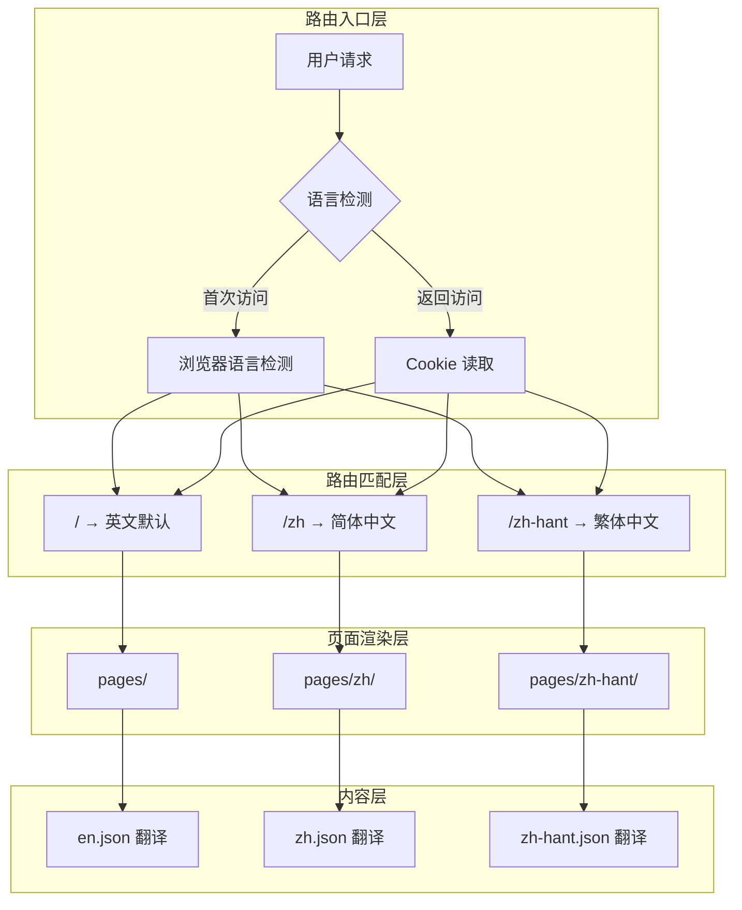

本文档详细阐述 TasyachTrip 项目所采用的多语言路由实现方案，涵盖路由架构设计、i18n 配置、语言切换机制以及 SEO 优化策略。

## 核心架构概述

本项目采用 **文件系统路由 + Nuxt i18n 模块** 的混合多语言方案。通过 `prefix_except_default` 路由策略实现三种语言的访问路径管理：英文作为默认语言（无 URL 前缀），简体中文和繁体中文则使用语言代码作为 URL 路径前缀。



这种架构确保每种语言拥有完全独立的页面实例，便于针对不同语言市场进行定制化内容展示，同时保持统一的代码结构。

Sources: [nuxt.config.ts](nuxt.config.ts#L62-L76)

## i18n 模块配置详解

Nuxt i18n 模块是整个多语言系统的核心，配置定义了语言列表、路由策略、语言检测机制等关键参数。

```typescript
// nuxt.config.ts
i18n: {
  locales: [
    { code: 'en', iso: 'en-AU', name: 'English', file: 'en.json' },
    { code: 'zh', iso: 'zh-CN', name: '简体中文', file: 'zh.json' },
    { code: 'zh-hant', iso: 'zh-TW', name: '繁體中文', file: 'zh-hant.json' },
  ],
  defaultLocale: 'en',
  langDir: 'locales',
  strategy: 'prefix_except_default',
  detectBrowserLanguage: {
    useCookie: true,
    cookieKey: 'i18n_redirected',
    redirectOn: 'root',
  },
  seo: true,
}
```

| 配置项 | 值 | 说明 |
|-------|-----|------|
| `defaultLocale` | `en` | 英文为默认语言，URL 无前缀 |
| `strategy` | `prefix_except_default` | 非默认语言添加路径前缀 |
| `langDir` | `locales` | 翻译文件存放目录 |
| `detectBrowserLanguage.useCookie` | `true` | 记住用户语言偏好 |
| `seo` | `true` | 启用 SEO 优化功能 |

### 路由策略对比

| 策略名称 | 英文 URL | 简体中文 URL | 繁体中文 URL | 适用场景 |
|---------|---------|-------------|-------------|---------|
| `prefix_except_default` | `/products` | `/zh/products` | `/zh-hant/products` | 默认语言无前缀 |
| `prefix_except_default` | `/` | `/zh/` | `/zh-hant/` | 首页路由 |
| `no_prefix` | `/products` | `/products` | `/products` | 单一语言检测（不推荐） |

Sources: [nuxt.config.ts](nuxt.config.ts#L62-L76)

## 文件系统路由结构

项目采用 Nuxt 的文件系统路由约定，每个语言版本对应一个独立的页面目录。这种结构使开发者能够为不同语言创建完全定制化的页面布局和内容。

```
pages/
├── index.vue                    # 英文首页 (/)
├── about.vue                    # 英文关于我们 (/about)
├── products/
│   ├── index.vue                # 产品列表 (/products)
│   ├── sightseeing-fishing-cruise.vue  # 产品详情
│   ├── private-charters.vue     # 私人包船
│   └── half-day-hook-dive-grill.vue   # 半日行程
├── zh/                          # 简体中文版本
│   ├── index.vue                # 首页 (/zh/)
│   ├── about.vue                # (/zh/about)
│   ├── products/
│   │   ├── index.vue
│   │   ├── sightseeing-fishing-cruise.vue
│   │   ├── private-charters.vue
│   │   └── half-day-hook-dive-grill.vue
│   └── ...
└── zh-hant/                     # 繁体中文版本
    ├── index.vue                # 首页 (/zh-hant/)
    ├── products/
    │   └── index.vue            # 产品列表（共享 zh 内容）
    └── ...
```

**关键设计决策**：简体和繁体中文的 `products/index.vue` 共享相同的翻译键和数据源，通过 i18n JSON 文件实现内容差异化，而非创建完全独立的页面文件。

Sources: [get_dir_structure](pages#L1-L40)

## 语言切换器实现

`LanguageSwitcher` 组件负责处理用户语言切换逻辑，利用 Nuxt i18n 提供的 `useSwitchLocalePath` 组合函数生成对应语言的切换链接。

```vue
<template>
  <div class="language-switcher">
    <button @click="isOpen = !isOpen">
      {{ currentLocaleLabel }}
    </button>
    
    <ul v-if="isOpen">
      <li v-for="locale in availableLocales" :key="locale.code">
        <NuxtLink :to="switchLocalePath(locale.code)">
          {{ locale.name }}
        </NuxtLink>
      </li>
    </ul>
  </div>
</template>

<script setup>
const { locale, locales } = useI18n()
const switchLocalePath = useSwitchLocalePath()
</script>
```

组件的核心功能包括：根据当前语言显示对应标签、从配置中过滤可用语言列表、点击切换时跳转到目标语言的等价页面。

**URL 映射示例**：

| 当前页面 | 切换到简体中文 | 切换到繁体中文 |
|---------|--------------|---------------|
| `/products` | `/zh/products` | `/zh-hant/products` |
| `/about` | `/zh/about` | `/zh-hant/about` |
| `/news/how-to-catch-lobster` | `/zh/news/how-to-catch-lobster` | `/zh-hant/news/how-to-catch-lobster` |

Sources: [components/layout/LanguageSwitcher.vue](components/layout/LanguageSwitcher.vue#L1-L127)

## 翻译文件组织

每种语言的 UI 文本存储在独立的 JSON 文件中，采用分层结构组织，涵盖导航、产品信息、SEO 元数据等模块。

```json
{
  "nav": {
    "home": "首页",
    "products": "出海行程",
    "about": "关于我们",
    "gallery": "相册",
    "news": "新闻动态",
    "faq": "常见问题",
    "contact": "联系我们"
  },
  "home": {
    "heroTitle": "探索霍巴特的风采",
    "heroSubtitle": "在欣赏美景的同时享受钓鱼、潜水和烧烤的乐趣"
  },
  "products": {
    "sightseeingTitle": "3小时观光海钓巡游",
    "sightseeingDesc": "加入我们的3小时观光钓鱼巡航..."
  },
  "seo": {
    "defaultTitle": "霍巴特钓鱼潜水船务 | 塔斯马尼亚专业船旅",
    "defaultDescription": "体验塔斯马尼亚霍巴特迷人的海岸线..."
  }
}
```

翻译键遵循 `section.subsection.key` 的命名约定，便于定位和维护。SEO 相关的翻译键集中管理，便于优化各语言的搜索引擎表现。

Sources: [i18n/locales/zh.json](i18n/locales/zh.json#L1-L113)

## 导航栏的语言感知链接

项目中的所有导航链接均使用 `useLocalePath()` 组合函数，确保链接自动适配当前语言环境。

```vue
<!-- AppHeader.vue -->
<nav>
  <NuxtLink :to="localePath('/')">{{ $t('nav.home') }}</NuxtLink>
  <NuxtLink :to="localePath('/products')">{{ $t('nav.products') }}</NuxtLink>
  <NuxtLink :to="localePath('/about')">{{ $t('nav.about') }}</NuxtLink>
  <NuxtLink :to="localePath('/news')">{{ $t('nav.news') }}</NuxtLink>
</nav>
```

`localePath()` 函数接收逻辑路径作为参数，自动返回当前语言对应的实际路径：
- 英文模式下：`localePath('/products')` → `/products`
- 简体中文模式下：`localePath('/products')` → `/zh/products`
- 繁体中文模式下：`localePath('/products')` → `/zh-hant/products`

Sources: [components/layout/AppHeader.vue](components/layout/AppHeader.vue#L1-L200)

## 动态路由与语言

新闻详情页使用 Nuxt 的动态路由 `[slug].vue` 文件，但当前实现采用硬编码内容而非基于 slug 的动态数据获取。

```vue
<!-- pages/news/[slug].vue -->
<template>
  <article>
    <h1>How to Catch Lobster in Tasmania</h1>
    <div class="article-body">
      <!-- 硬编码的文章内容 -->
    </div>
  </article>
</template>

<script setup>
const route = useRoute()
// route.params.slug 可用于动态内容获取
</script>
```

虽然路由支持 slug 参数，但中文版本的新闻详情页文件（`pages/zh/news/[slug].vue`）尚未创建，这是后续可优化的方向。

Sources: [pages/news/[slug].vue](pages/news/[slug].vue#L1-L156)

## 预渲染路由配置

为实现静态站点部署（Vercel），需在 `nuxt.config.ts` 中显式声明所有需要预渲染的路由，包括每种语言的所有页面。

```typescript
nitro: {
  preset: 'vercel-static',
  prerender: {
    crawlLinks: true,
    routes: [
      // 英文路由
      '/', '/products', '/about', '/gallery', '/news',
      '/news/how-to-catch-lobster-tasmania',
      // 简体中文路由
      '/zh/', '/zh/products', '/zh/about', '/zh/news',
      '/zh/news/how-to-catch-lobster-tasmania',
      // 繁体中文路由
      '/zh-hant/', '/zh-hant/products', '/zh-hant/news',
    ],
  },
}
```

配置使用 `crawlLinks: true` 开启自动链接爬取，但显式声明路由确保关键页面不会因爬虫限制而遗漏。

Sources: [nuxt.config.ts](nuxt.config.ts#L14-L50)

## SEO 多语言优化

每种语言的页面都配置了对应的 SEO 元数据，包括语言属性、canonical 链接和 Open Graph 标签。

```typescript
// pages/zh/index.vue
useHead({
  htmlAttrs: { lang: 'zh-CN' },  // HTML 文档语言属性
  title: t('seo.defaultTitle'),
  meta: [
    { name: 'description', content: t('seo.homeDescription') },
    { property: 'og:url', content: 'https://www.tasyachttrip.com.au/zh' },
  ],
  link: [
    { rel: 'canonical', href: 'https://www.tasyachttrip.com.au/zh' },
  ],
})
```

| SEO 元素 | 英文 | 简体中文 | 繁体中文 |
|---------|------|---------|---------|
| `htmlAttrs.lang` | `en` | `zh-CN` | `zh-TW` |
| canonical | `/` | `/zh/` | `/zh-hant/` |
| og:url | 主域名 | 带 /zh 前缀 | 带 /zh-hant 前缀 |

Sources: [pages/zh/index.vue](pages/zh/index.vue#L85-L100)

## 架构优势与局限性

### 架构优势

**独立定制能力**：每种语言拥有独立的页面文件（`.vue`），可针对不同市场进行完全定制的内容展示、布局调整和功能差异。

**SEO 友好**：清晰的 URL 结构（`/zh/`, `/zh-hant/`）便于搜索引擎索引，不同语言版本有明确的 canonical 声明避免重复内容问题。

**开发体验**：文件系统路由约定使页面结构一目了然，翻译文件集中管理便于国际化团队协作。

### 现存局限性

**内容同步成本**：当英文内容更新时，需要手动同步更新中文版本的内容，缺少内容管理系统的自动化工作流。

**繁体中文覆盖不完整**：当前 `zh-hant` 版本的产品详情页（`sightseeing-fishing-cruise.vue` 等）尚未创建，`products/index.vue` 硬编码引用了 `/zh/` 路径，存在内容共享但路径显示不一致的问题。

**动态路由缺失**：新闻详情页的中文版本未创建对应的 `[slug].vue` 文件，限制了内容扩展性。

## 后续优化建议

1. **完善繁体中文版本**：创建 `pages/zh-hant/` 下的产品详情页和新闻详情页，确保与简体中文版本的功能对等。

2. **引入内容管理系统**：考虑集成 Nuxt Content 或外部 CMS，实现跨语言内容同步和翻译工作流管理。

3. **动态路由数据层**：将新闻和产品数据迁移至结构化数据源，使用 slug 驱动的动态路由替代硬编码页面。

---

**相关文档**：
- [项目架构总览](5-xiang-mu-jia-gou-zong-lan) — 了解整体项目结构
- [语言切换器](13-yu-yan-qie-huan-qi) — 组件实现细节
- [SEO 修复方案](18-seo-xiu-fu-fang-an) — SEO 优化完整指南
- [预渲染路由配置](21-yu-xuan-ran-lu-you-pei-zhi) — 静态部署配置